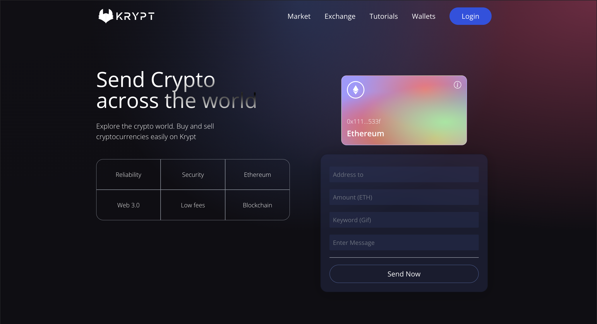

# Krypt 

#### Krypt is a Web 3.0 blockchain app built using React, Vite, Solidity, and Tailwind.

## To use the app you must:

1) go to the app <a href="https://krypt-transfers.netlify.app/" target="_blank" rel="noopener noreferrer">here</a>
2) create a MetaMask account [here](https://metamask.io)
4) connect with your MetaMask wallet

## Client Side:
The UI was built using **React**, **Vite** and **Tailwind**.

## Smart Contract:
Written on the **Ethereum Virtual Machine (EVM)** network using the **Solidity** programming language.

# Description
**Krypt** is a Web 3.0 blockchain app designed to send and receive Ethereum cryptocurrency built with **React**, **Solidity**, **Tailwind** and **Vite**. Using the **MetaMask** extension on your browser and through pairing your **MetaMask** crypto wallet with the app it is possible to send and receive **Ethereum**. 

# Take a Look at the App

## Desktop:

<kbd>

</kbd>

## Mobile:

<kbd>

</kbd>

# Tools Used

### Development Environment
* Node.js

### Blockchain Testing (Ethereum faucet)
* Goerli

### Libraries & Frameworks
* React 
* Vite
* Tailwind 

### Hosting Frontend
* Netlify

### Other
* Solidity
* Alchemy
* Giphy Developer

# Features

### Users are able to:

* pair a MetaMask crypto wallet with Krypt
* send and receive Ethereum
* send a message and GIF along with the timestamped transaction
* see all previous transactions

</body>
